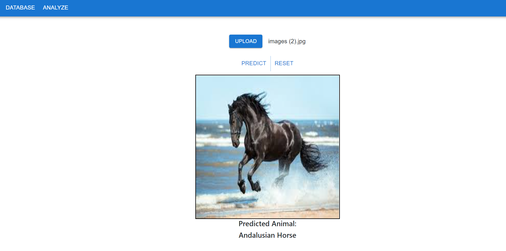
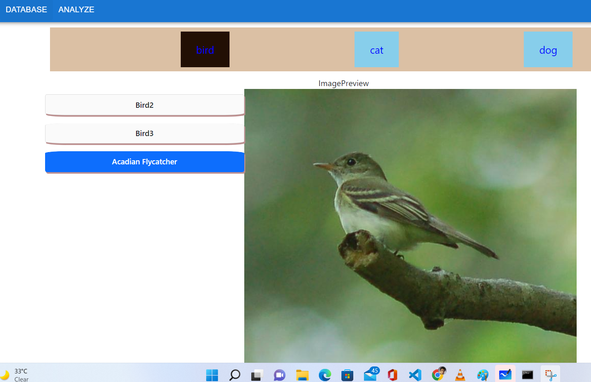

# Backend Of Multifold Animal Breeds Classification App (On going)

## About
This project take animal picture in input and predict animal with breed and also give animal details.

## Goal
- Building web application that will take input image and sent to backend which will do prediction and sent animal breeds and other details to frontend which will show to user (DONE).

- Building android application user interface which will support live prediction of animal also (Future Scope)

- Making Responsive and interactive web application (Ongoing).

- Building backend service which will handle frontend request and send predicted data to frontend (Done).

- Building Apis which will responsible to get and post animal data (Done)

- Data Collection , Preprocessing and Building deep learning model for classfication of Animal (Done).

Tech Stack:

- Data Science
- Deep learning
- Flask
- Fast AI
- Tensor Flow
- React JS
- Open CV
- Android Java
- SQlite DB

## Dataset
- Collected 450 breeds images of around 20+ Animals
- Created Form for adding any new animal / breeds detail.
- Created End point for getting all animals / breed detail. 

## Backend API UI
1. Home Page Of Api  

2. All Animal Data  

3. Add New animal  

4. Get Specific Breed Detail  

5. Add new breed detail  

## Frontend UI (Ongoing)
1. Upload and predict  

2. Show all breed database  

## Team
1. Rohit Kumar Gupta
2. Akash Baranwal
