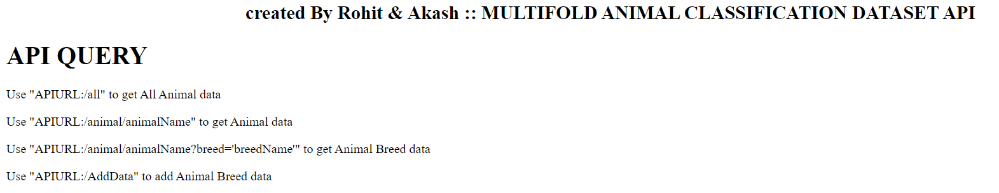
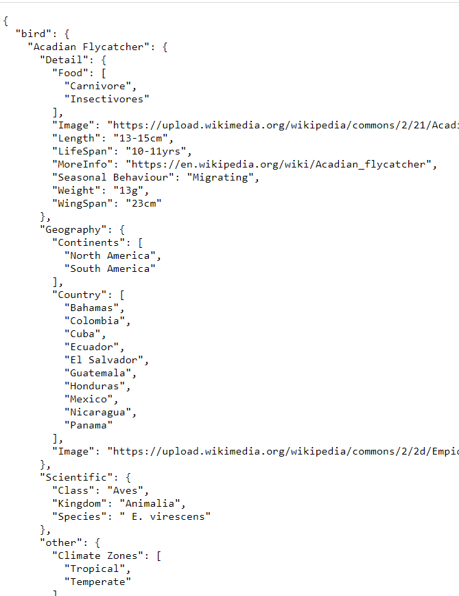
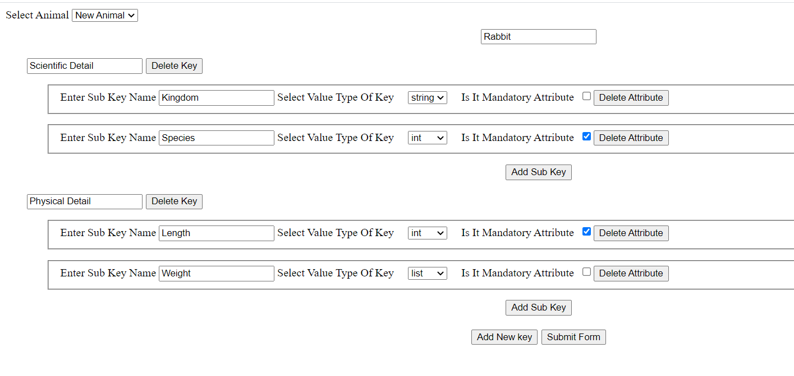
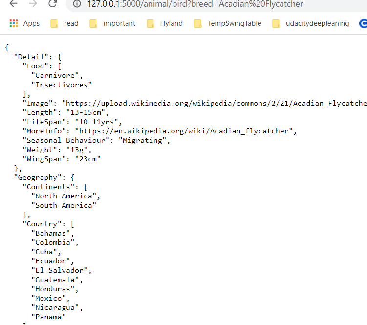
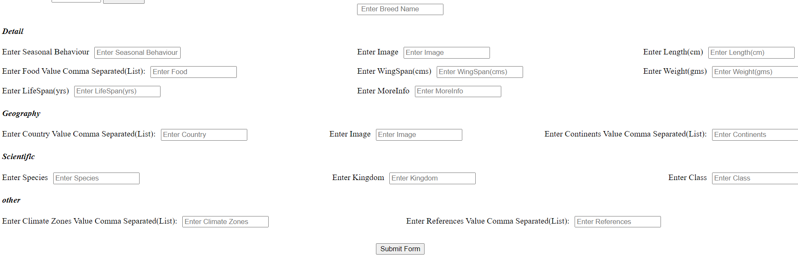

# Backend Of Multifold Animal Breeds Classification App (On going)

## About
This is python flask api that will add new animal and breed detail and also give breed data detail.

## Pending
- Adding all breeds data detail
- Creating React Web app to classify any animal detail
- Creating Android app for classification.
- adding sqlite database instead of json file for storing breed detail.

## Done
- Created ML model for animal classification
- Collected 450 breeds images
- Created Form for adding any new animal / breeds detail.
- Created End point for getting all animals / breed detail. 

## UI
1. Home Page Of Api  

2. All Animal Data  

3. Add New animal  

4. Get Specific Breed Detail  

5. Add new breed detail  

## Team
1. Rohit Kumar Gupta
2. Akash Baranwal
